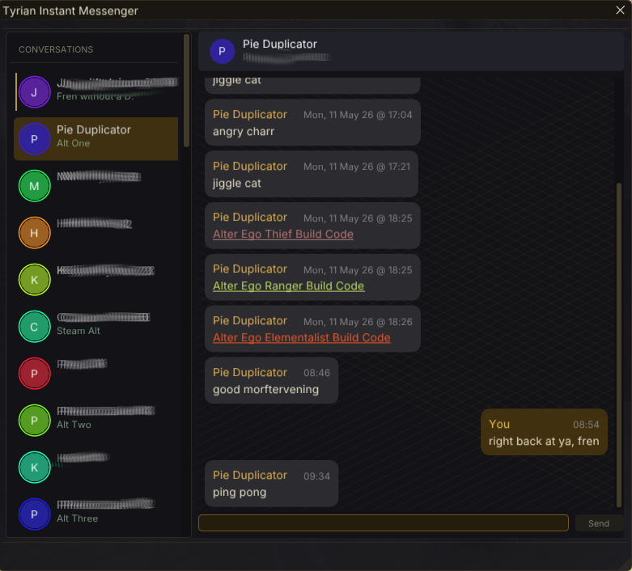
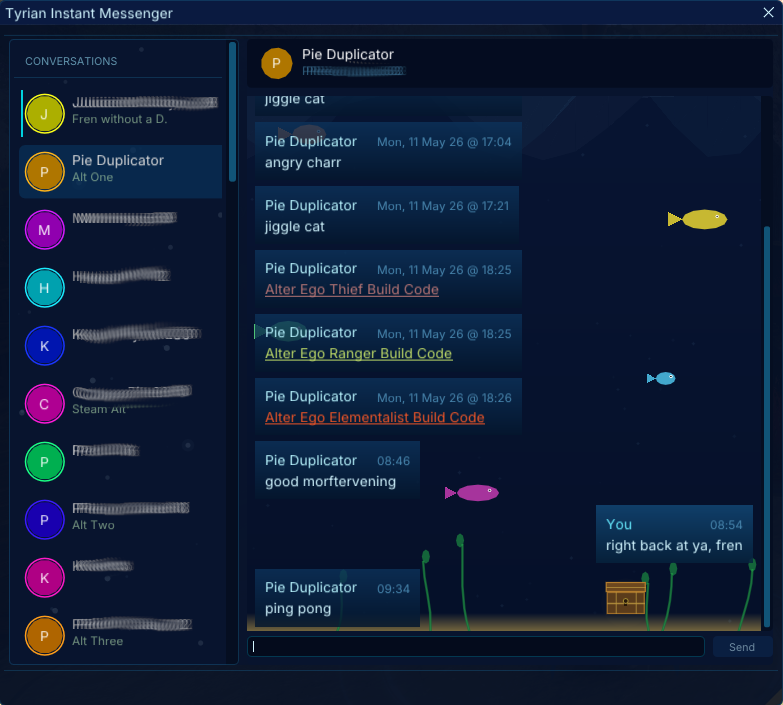
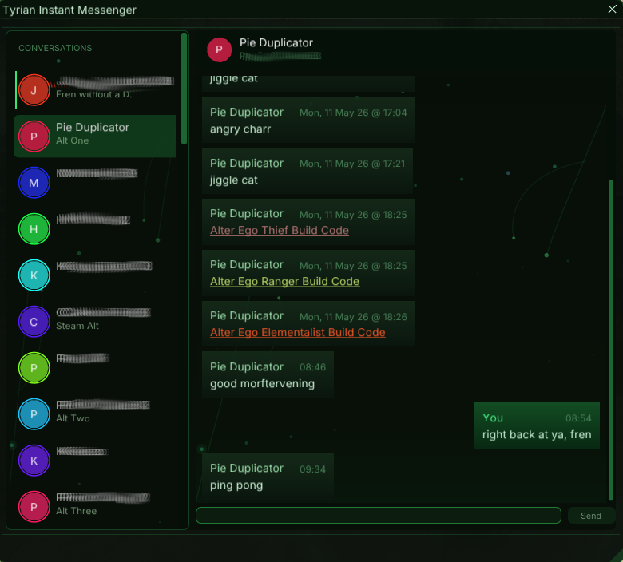

# Tyrian Instant Messaging

A Guild Wars 2 addon for [Raidcore Nexus](https://raidcore.gg/Nexus) that provides a persistent instant messaging window for whisper conversations.

## AI Notice

This addon has largely been created using Claude. I understand that some folks have a moral, financial or political objection to creating software using an LLM. I just wanted to make a useful tool for the GW2 community, and this was the only way I could do it.

If an LLM creating software upsets you, then perhaps this repo isn't for you. Move on, and enjoy your day.

## Features

- **Persistent whisper history** — conversations are saved to disk and restored between sessions
- **Contact list** with unread indicators and optional nicknames
- **Chat link support** — items, waypoints, skills, traits, recipes, skins, outfits and build templates are parsed inline with tooltips; item names and icons are resolved via the GW2 API
- **URL toast notifications** — when another player posts a URL in a trackable channel (local, map, party, guild, squad), a draggable toast offers to open it in your browser
- **Click-to-open links** — click any URL in a chat bubble to open it; other link types copy to clipboard
- **Sound notifications** — drop a `.wav` or `.mp3` into `addons/TyrianIM/sounds/` to play on incoming whispers
- **Floating notification icon** — bobs in a corner of the screen and flashes on unread messages
- **13 built-in themes** with animated backgrounds, each with a matching floating icon
- **Custom themes** via TOML files — see [themes.md](themes.md)

## Screenshots







## Requirements

- [Nexus](https://raidcore.gg/Nexus)
- **GW2-Chat** addon by jsantorek (install via Nexus — provides the "Events: Chat" API that TyrianIM hooks into)

## Installation

1. Install Nexus and the GW2-Chat addon
2. Copy `TyrianIM.dll` to `<GW2>/addons/`
3. Launch GW2 — toggle the window with **Ctrl+Shift+M** or the Quick Access icon

## Building

### Prerequisites
- CMake 3.20+
- MinGW cross-compiler (`x86_64-w64-mingw32-gcc`, `x86_64-w64-mingw32-g++`)

### Build Commands
```bash
mkdir build && cd build
cmake -DCMAKE_TOOLCHAIN_FILE=../cmake/mingw-toolchain.cmake ..
make
```

Output: `build/TyrianIM.dll`

## License

MIT
